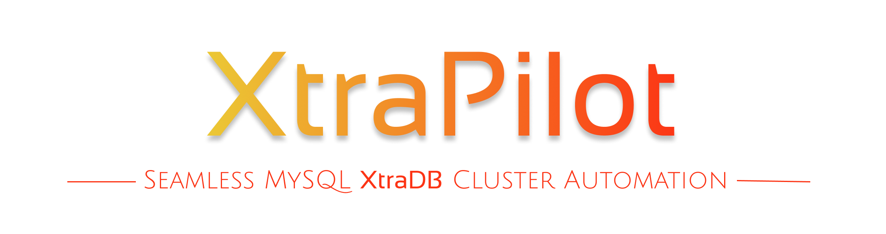

<p align="center">
  
  
    
  
  
</p>


<p align="center">
    <a href="#-overview">Overview</a> | <a href="#-features">Features</a> | <a href="#-setup">Setup</a> | <a href="#-usage">Usage</a> | <a href="#-license">License</a>
</p>


## 🌟 **Overview**  
 <b>XtraPilot</b> is an Ansible playbook designed to simplify the installation, configuration, and management of MySQL XtraDB Cluster. It automates cluster setup, ensures high availability, and provides seamless scaling and maintenance.


## ✨ Features

- ✅ **Automated Deployment:** Set up a MySQL XtraDB Cluster with minimal effort.
- ✅ **High Availability:** Ensures a resilient, self-healing cluster.
- ✅ **Effortless Scaling:** Add or remove nodes with ease.
- ✅ **Backup & Restore:** Automated backup strategies for data safety.
- ✅ **Monitoring & Health Checks:** Keep track of cluster performance.
- ✅ **Secure & Optimized:** Configures best practices for security and efficiency.
- ✅ **Cluster Encryption:** Enables and configures encryption for both cluster and client traffic.
- ✅ **Private Repository Support:** Supports deployment from private repositories.

## ⚙️ Setup

1. **Clone the repository:**
   ```bash
   git clone https://github.com/your-repo/xtrapilot.git
   cd xtrapilot
   ```
2. **Configure the inventory file (`hosts`) with your node details.**
3. **Update the configuration in `group_vars/all.yaml`** according to your environment.
4. **Configure your SSH access to all targets.**

## 🚀 Usage

**Deploy the cluster:**
   ```sh
   ansible-playbook play-xtraDB.yml -i hosts
   ```

## 📝 License

This project is licensed under the MIT License.

## 📢 **Note**

This repository is a showcase version of the original project. If you are interested in accessing the full version, please feel free to contact us.


<h3 align=center> Happy Automating! 🎉 </h3>

